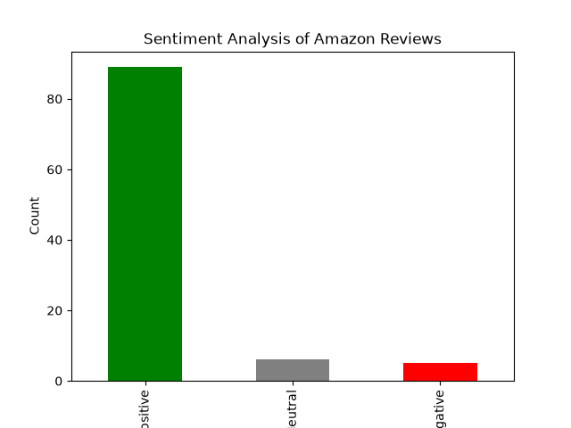

# Sentiment Analysis of Amazon Reviews

A Python project that classifies Amazon product reviews as Positive, Negative or Neutral using TextBlob. Built as part of the CodeAlpha internship.

## What This Project Does

- Loads Amazon reviews from `amazon_reviews.csv`
- Takes the first 100 reviews for a quick run
- Calculates sentiment polarity with TextBlob (above 0 is Positive, below 0 is Negative, 0 is Neutral)
- Counts each sentiment and saves a bar chart

## Files

- `sentiment.py` : sentiment analysis code
- `amazon_reviews.csv` : review dataset
- `sentiment_chart.png` : saved bar chart

## Chart

## How to Run

    pip install pandas matplotlib textblob
    python sentiment.py

## Tools Used

Python, pandas, matplotlib, TextBlob
